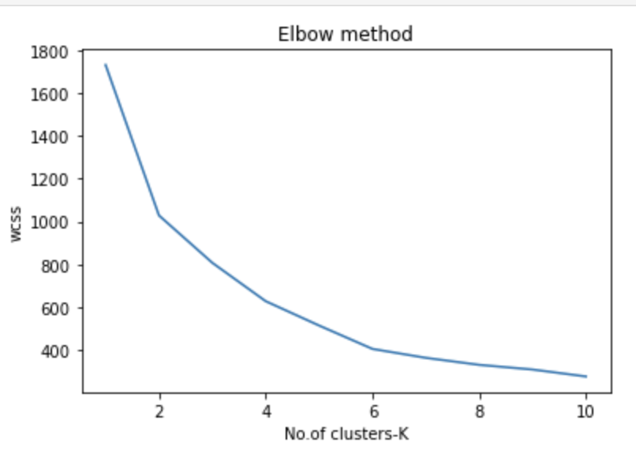
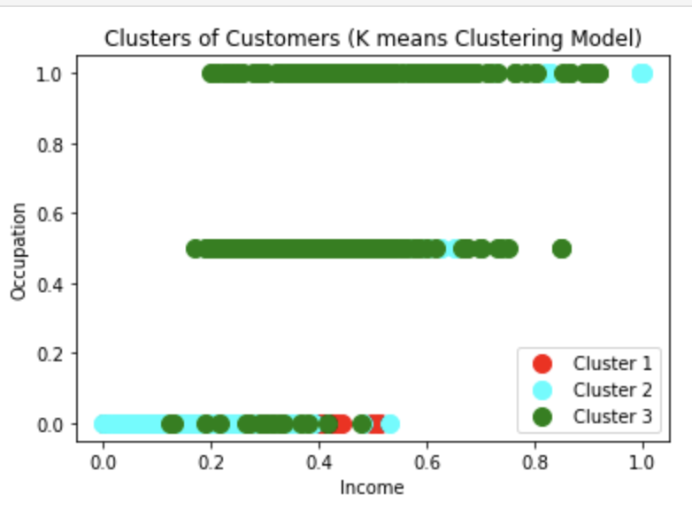
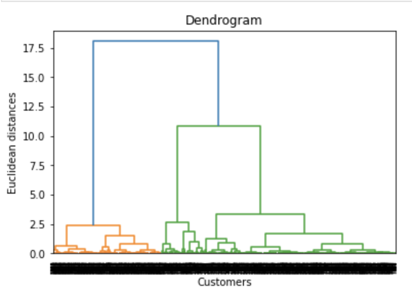
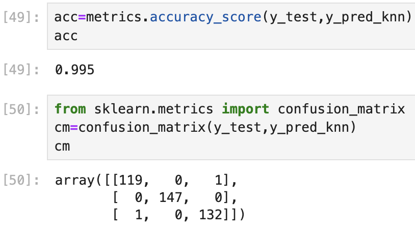
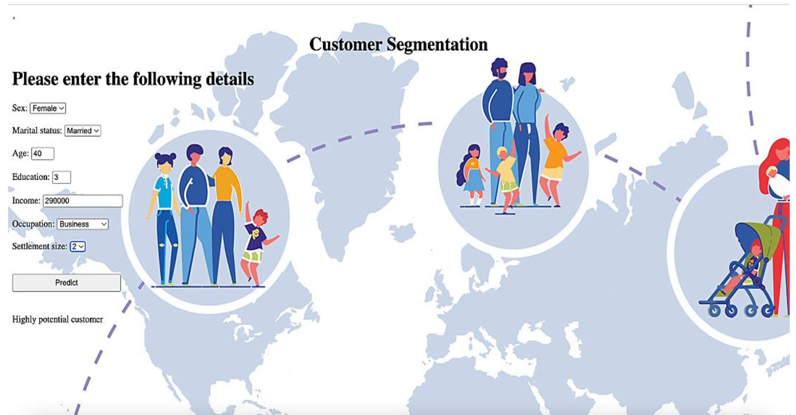
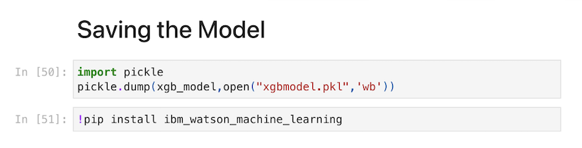
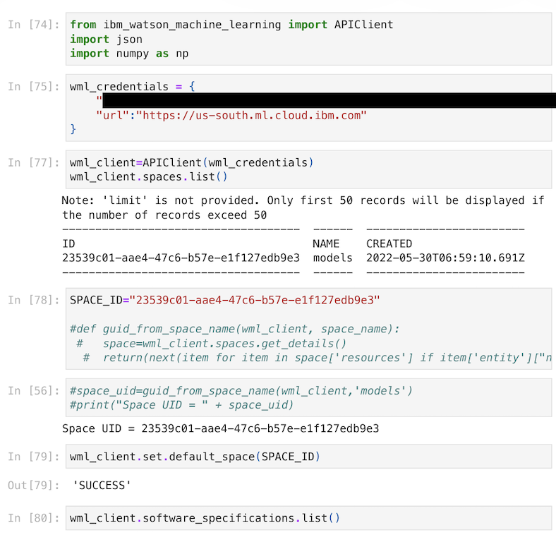
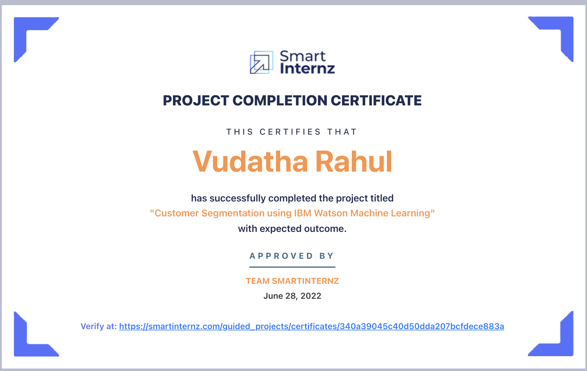

# SmartInternz Data Science Internship – Customer Segmentation (IBM Watson + Flask)

A structured portfolio of my **SmartInternz Data Science Internship (May–Jun 2022)**, covering foundational exercises (Python, NumPy, Visualisation, Preprocessing) and a capstone project that delivers an end-to-end **customer segmentation** solution with a **Flask web interface** and **IBM Watson Machine Learning (WML) deployment (documented)**.

> **Goal:** I worked through a complete, industry-style workflow—data handling → clustering → supervised modelling → deployment → UI—while building strong fundamentals through sequential assignments.

---

## Table of Contents
- [Internship Snapshot](#internship-snapshot)
- [What I Delivered](#what-i-delivered)
- [Capstone Project: Customer Segmentation](#capstone-project-customer-segmentation)
  - [Business Context](#business-context)
  - [Dataset](#dataset)
  - [Solution Approach](#solution-approach)
  - [Results & Outputs](#results--outputs)
  - [Demo (Flask UI)](#demo-flask-ui)
  - [Local Deployment (Recommended)](#local-deployment-recommended)
  - [IBM Watson Deployment](#ibm-watson-deployment)
- [Assignment Portfolio (Sequential Learning)](#assignment-portfolio-sequential-learning)
- [Setup](#setup)
- [Credential](#credential)


---

## Internship Snapshot

**Program:** SmartInternz Data Science Internship  
**Location:** Chennai, India 
**Duration:** May 2022 – Jun 2022  
**Capstone:** Customer Segmentation using IBM Watson Machine Learning + Flask

**Core skills developed**
- Python programming for analytics
- Numerical computing with NumPy
- Exploratory Data Analysis (EDA) and visualisation
- Data preprocessing and encoding for ML
- Customer segmentation using clustering
- Supervised classification for segment prediction
- Deployment concepts (IBM WML) + UI integration (Flask)

---

## What I Delivered

### ✅ End-to-end capstone (deployment-ready concept)
- Built a segmentation workflow that groups customers using **K-Means** and **Hierarchical Clustering**
- Converted cluster outputs into **segment labels** and trained supervised models to predict segments
- Benchmarked multiple algorithms (Decision Tree, Random Forest, XGBoost, KNN) and selected a final model for deployment
- Delivered a **Flask UI** to collect customer attributes and return a segment prediction

### ✅ Foundation assignments (skills built sequentially)
- Python programming fundamentals (strings, lists, dicts, formatting, problem solving)
- NumPy exercises (array creation, reshaping, slicing, statistics)
- Seaborn/Matplotlib visualisations (line, scatter, bar, histogram, heatmap, boxplot, pairplot, jointplot, KDE)
- Preprocessing workflow (missing values, one-hot encoding, train/test split)

---

## Capstone Project: Customer Segmentation

### Business Context
Customer segmentation helps organisations identify groups of customers with similar characteristics so they can:
- target marketing more effectively,
- personalise offers,
- prioritise high-potential customers,
- improve customer retention and lifetime value.

This project predicts customer segment potential using demographic and socioeconomic inputs.

---

### Dataset
This repo includes a reproducible sample dataset:

- File: **`Segmentation.csv`**
- Shape: **2000 rows × 7 features**
- Input features used in the app:
  - `Sex`, `Marital status`, `Age`, `Education`, `Income`, `Occupation`, `Settlement size`

> Note: the dataset in this repo is included for reproducibility. The approach is designed to scale to larger customer datasets in real deployments.

---

### Solution Approach

#### 1) Clustering (Unsupervised Learning)
I first explored segmentation using clustering algorithms:
- **K-Means** (validated using WCSS/Elbow Method)
- **Hierarchical clustering** (validated using a dendrogram)

These steps create meaningful customer groups without predefined labels.

#### 2) Segment Prediction (Supervised Learning)
To enable real-time predictions in an application (instead of re-running clustering each time), I trained supervised models to predict the segment label based on the 7 input attributes.

Models benchmarked:
- Decision Tree  
- Random Forest  
- XGBoost  
- KNN  

The final model was saved (e.g., `xgbmodel.pkl`) for deployment / inference.

---

### Results & Outputs

#### Elbow Method (Selecting optimal K)


#### Cluster Visualisation (K-Means)


#### Hierarchical Clustering (Dendrogram)


#### Model Evaluation (Example Confusion Matrix / Accuracy)


> ✅ These visuals are taken from my internship notebooks/report to show the actual workflow and outputs.

---

### Demo (Flask UI)

The Flask interface accepts the 7 feature inputs and returns one of three segment labels:

- **Not a potential customer**
- **Potential customer**
- **Highly potential customer**



---

### Local Deployment (Recommended)

Because cloud credentials should never be committed to GitHub, this repo is designed so you can run the demo **locally** using the saved model file.

#### 1) Install dependencies
```bash
pip install numpy pandas scikit-learn matplotlib seaborn xgboost flask joblib
```

#### 2) Create a local Flask app (example)

If you don’t already have a local version, create app.py in the project root and paste the following:
```bash
import numpy as np
import pandas as pd
import joblib
from flask import Flask, request, render_template

app = Flask(__name__)

# Load trained model artifact (saved during internship project)
model = joblib.load("xgbmodel.pkl")

@app.route("/")
def home():
    return render_template("template.html")

@app.route("/predict", methods=["POST"])
def predict():
    # Read values in the same order as the form fields
    vals = [float(x) for x in request.form.values()]
    cols = ["Sex","Marital status","Age","Education","Income","Occupation","Settlement size"]
    X = pd.DataFrame([vals], columns=cols)

    pred = int(model.predict(X)[0])

    if pred == 0:
        msg = "Not a potential customer"
    elif pred == 1:
        msg = "Potential customer"
    else:
        msg = "Highly potential customer"

    return render_template("template.html", prediction_text=msg)

if __name__ == "__main__":
    app.run(debug=True)
```

#### 3) Run the application
```bash
python app.py
```

Then open: http://127.0.0.1:5000/

## IBM Watson Deployment

As part of the internship, the trained model was also deployed to IBM Watson Machine Learning and tested via a scoring endpoint.

To keep this repository secure, the cloud deployment is documented via screenshots rather than shipping credentialed scripts.

#### Saving Model + Install WML


#### Deployment Details


## Assignment Portfolio (Sequential Learning)

These assignments reflect the structured learning path of the internship, progressing from programming basics to ML-ready workflows.

**1) Assignment 1 — Python Fundamentals**

**Focus:** core problem solving and Python syntax

- String operations, splitting, formatting
- Lists, nested indexing, dictionaries
- Basic logic and function-style exercises
- File: **Vudatha Rahul_Assignment 1.pdf**

**2) Assignment 2 — NumPy**

**Focus:** numerical computing foundations

- Array creation (zeros/ones/range)
- Matrix reshaping and slicing
- Basic statistics and vectorised operations
- File: **Vudatha Rahul_Assignment 2.pdf**

**3) Assignment 3 — Data Visualisation**

**Focus:** EDA and communicating insights

- Line plot, scatter, bar plot
- Histogram and count plot
- Heatmap correlation
- Boxplot, pairplot, jointplot, KDE
- File: **Vudatha Rahul_Assignment 3.pdf**

**4) Assignment 4 — Data Preprocessing Workflow**

**Focus:** preparing real datasets for modelling

- Missing value checks
- Encoding categorical variables (OneHotEncoder)
- Train/test split, feature/target separation
- StandardScaler usage (where required)
- File: **Vudatha Rahul_Assignment 4.pdf**

## Setup

This repo is runnable locally with Python 3.8+.

**Recommended:**
- Create a virtual environment
- Install dependencies
- Run the Flask demo (local mode)

## Credential

Project completion certificate:

#### Certificate


**Certificate text:
“Customer Segmentation using IBM Watson Machine Learning” — Approved by SmartInternz (June 28, 2022)**
